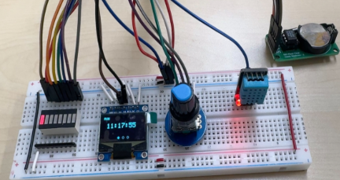
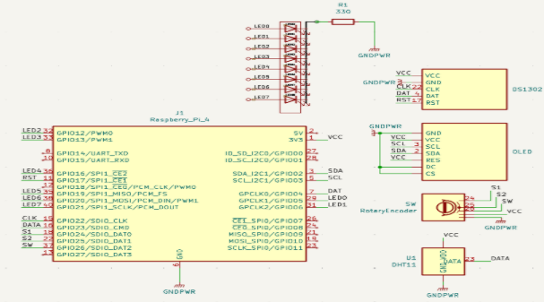
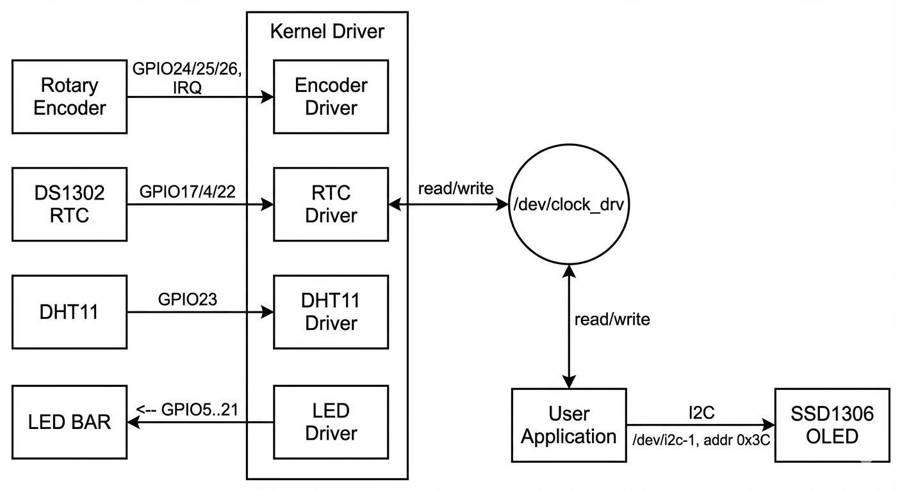
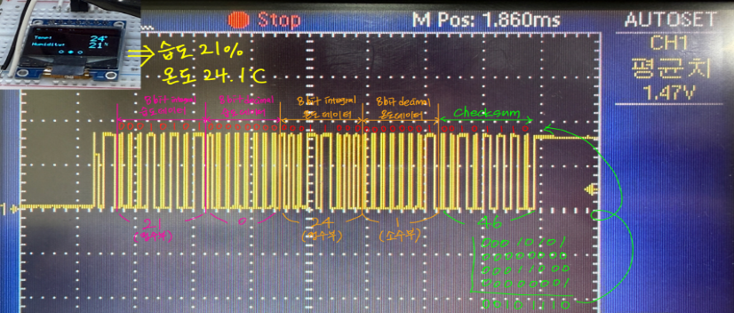

# 🌡️Discomfort-Index 기반 환경 모니터링 & UI 시스템 (Linux Kernel Device Driver) (2025.12.29~2026.01.06) [3인]  
> **RTC + 온습도(DHT11) + 로터리엔코더(IRQ) + OLED(SSD1306) + LED Bar**를 연동하여  
> **현재 시간/온습도/불쾌지수(Discomfort Index)** 를 표시하고, **불쾌지수 단계에 따라 LED Bar를 자동 제어**하는 임베디드 리눅스 프로젝트

---

## 1) 프로젝트 소개
본 프로젝트는 Linux SBC(예: Raspberry Pi) 환경에서  
**커널 디바이스 드라이버(/dev/clock_drv)** 를 통해 하드웨어(DS1302, DHT11, Rotary Encoder, LED Bar)를 제어하고,  
유저 애플리케이션에서 **SSD1306 OLED UI(3페이지)** 로 상태를 시각화하는 시스템입니다.

- **Kernel 영역**: 실시간 입력(IRQ), 센서 읽기, LED 제어, RTC 읽기/설정
- **User 영역**: OLED 렌더링(UI) + 불쾌지수 계산 + LED 단계 제어

---

## 2) 핵심 기능 (Core Features)
- ✅ **DS1302 RTC 시간 Read/Write** (BCD 변환 포함)
- ✅ **로터리 엔코더 IRQ 기반 입력 처리** (페이지 전환 / 시간 편집)
- ✅ **SW 버튼 Short/Long Press 처리**
  - Short: 편집 필드 변경(HOUR→MIN→SEC)
  - Long(≥1초): 편집 모드 진입/저장(DS1302 반영)
- ✅ **DHT11 온습도 측정 + 캐싱(DHT_CACHE_MS=2000ms)** 로 안정성/부하 개선
- ✅ **불쾌지수(Discomfort Index) 계산 및 등급화**
- ✅ **8-LED Bar 단계 출력(0~8단계)**
- ✅ **OLED(SSD1306 I2C, 0x3C) 3페이지 UI 표시**
  1) Clock(RUN/EDIT)  2) Weather(Temp/Hum)  3) DI(불쾌지수 + 아이콘 + LED)

---

## 3) 전체 시스템 구성 (Hardware)

### 3-1. 구성 요소

  

- **Linux SBC (Raspberry Pi 등)**: 커널 드라이버 + 유저앱 실행
- **DS1302 RTC**: 현재 시간 유지 및 설정(전원 OFF 대비)
- **DHT11**: 온도/습도 입력
- **Rotary Encoder(S1/S2/SW)**: UI 페이지 이동 / 시간 편집 입력(IRQ)
- **SSD1306 OLED(128x64, I2C, 0x3C)**: UI 출력
- **8-LED Bar**: 불쾌지수 단계 표시

---

### 3-2. GPIO 매핑

  

| 구분 | 핀 | GPIO(BCM) | 의미 |
|---|---:|---:|---|
| RTC | RST | 17 | DS1302 Reset |
| RTC | DAT | 4 | DS1302 Data |
| RTC | SCLK | 22 | DS1302 Clock |
| Encoder | S1 | 24 | 회전 입력(IRQ) |
| Encoder | S2 | 25 | 방향 판별 |
| Encoder | SW | 26 | 버튼 입력(IRQ) |
| Sensor | DHT | 23 | DHT11 DATA |
| LED Bar | LED0~7 | 5,6,12,13,16,19,20,21 | 단계 출력 |

---

### 3-3. 전체 구조 다이어그램

  

---

## 4) DHT11 통신 파형 분석 (Oscilloscope Verification)

DHT11은 **단선(1-Wire 유사) + 타이밍 기반 프로토콜**이라  
GPIO 제어/샘플링 타이밍이 조금만 틀어져도 **Timeout / 잘못된 값**이 나기 쉽습니다.  
본 프로젝트에서는 커널 드라이버에서 DHT11을 읽기 때문에, 오실로스코프로 실제 파형을 확인하여  
**Start 신호 → Sensor 응답 → 40bit 데이터(습도/온도/체크섬)** 흐름을 검증했습니다.

  

### 4-1. DHT11 프로토콜 요약
- **Host(Start)**  
  - DATA를 **LOW로 약 18ms** 유지 → **HIGH 20~40us**
- **Sensor(Response)**  
  - **LOW 80us → HIGH 80us**
- **Data (총 40bit)**  
  - 각 bit는 공통으로 **LOW 50us** 이후 HIGH 길이로 0/1 구분  
  - `0`: HIGH 약 **26~28us**  
  - `1`: HIGH 약 **70us**
- 비트 구성(총 5바이트 = 40bit)
  1) Humidity Int (8bit)  
  2) Humidity Dec (8bit)  
  3) Temperature Int (8bit)  
  4) Temperature Dec (8bit)  
  5) Checksum (8bit) = (앞 4바이트 합) & 0xFF

---

### 4-2. 파형 해석 (업로드한 캡처 기준)
아래 구간이 순서대로 나타납니다.

1) **Start Signal (Host)**
- MCU가 데이터 라인을 길게 LOW로 끌어내려(≈18ms) 센서에 통신 시작을 알림

2) **Response (DHT11)**
- 센서가 **80us LOW → 80us HIGH**로 응답하여 준비 상태를 알림

3) **40-bit Data Stream**
- 총 5바이트가 전송됨 (Humidity/Temp/Checksum)
- 각 bit는 `LOW(50us)` 이후 HIGH 폭으로 0/1 판별

> 캡처에 표시된 값 예시처럼  
> **습도 21%**, **온도 24.1°C**가 디코딩되는 형태로 확인 가능

---

### 4-3. 커널 드라이버에서 DHT11을 안정적으로 읽기 위한 포인트
DHT11은 타이밍 민감도가 매우 높기 때문에 아래를 적용했습니다.

- **인터럽트 영향 최소화**
  - 측정 구간에서 `local_irq_save()` 등으로 타이밍 흔들림을 줄임
- **측정 캐싱**
  - `DHT_CACHE_MS=2000ms`로 과도한 재측정 방지 → 안정성/부하 개선
- **Checksum 검증**
  - 5번째 바이트로 데이터 무결성 확인 → 이상값 필터링

---

